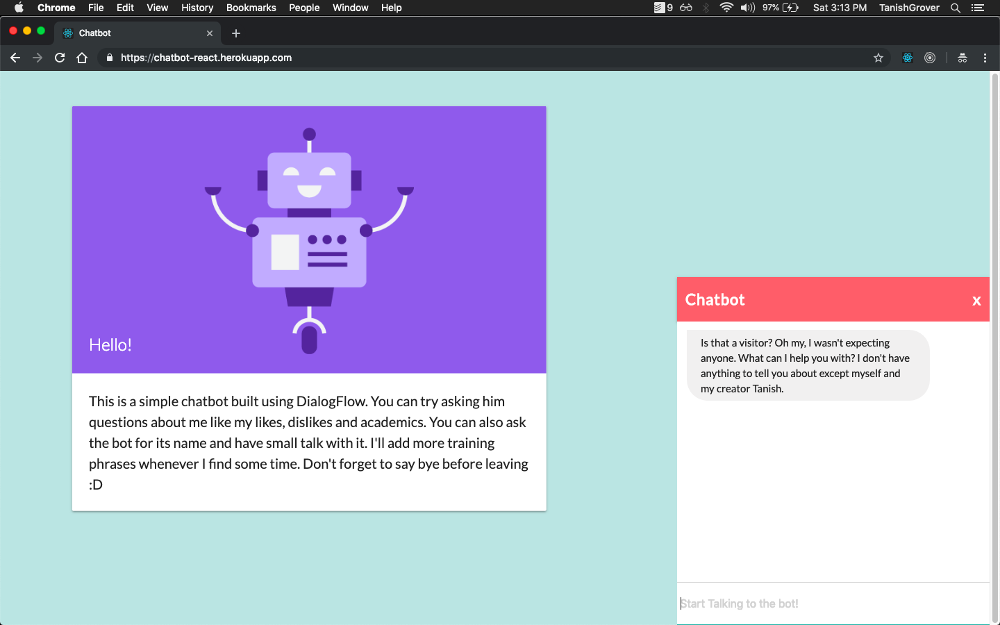
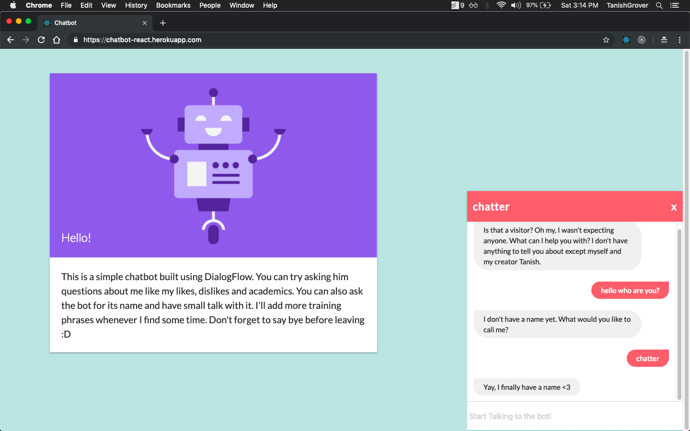
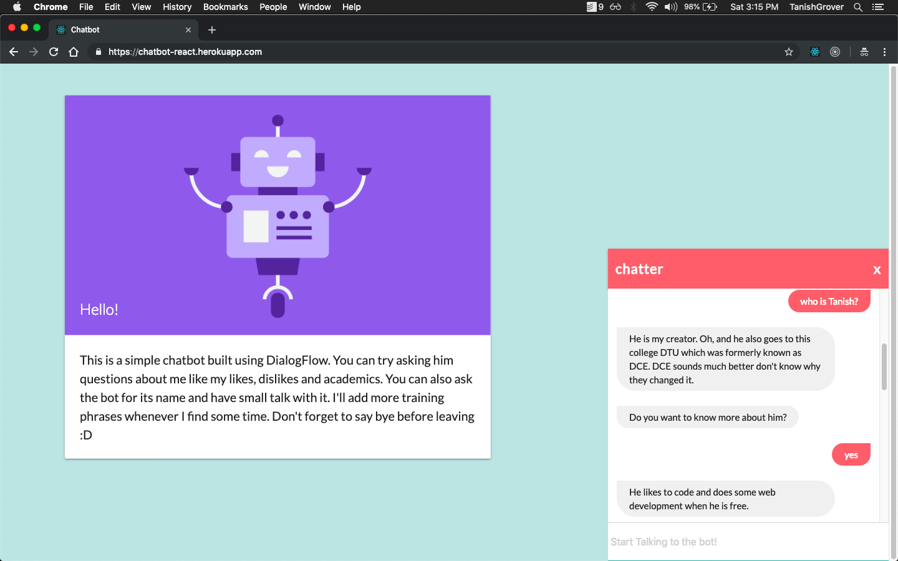

# React-Chatbot
DialogFlow chatbot which answers a few questions about me in a funny way.
It uses ReactJS on the frontend and nodeJS on the backend.
(With the end of Heroku free tier the site is also down now)

## Getting Started
- Get your google credentials and create a dev.js file in the config folder.
- Add all the values in prod.js in dev.js file.
- Run the following commands:
```
npm install
npm run start:dev
```
- Go to localhost:5000


## Demo
### The chatbot greets you on opening the website


---

### Some examples of conversations with the bot




